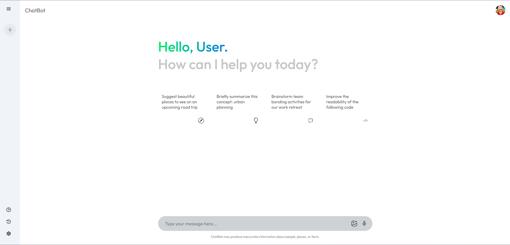
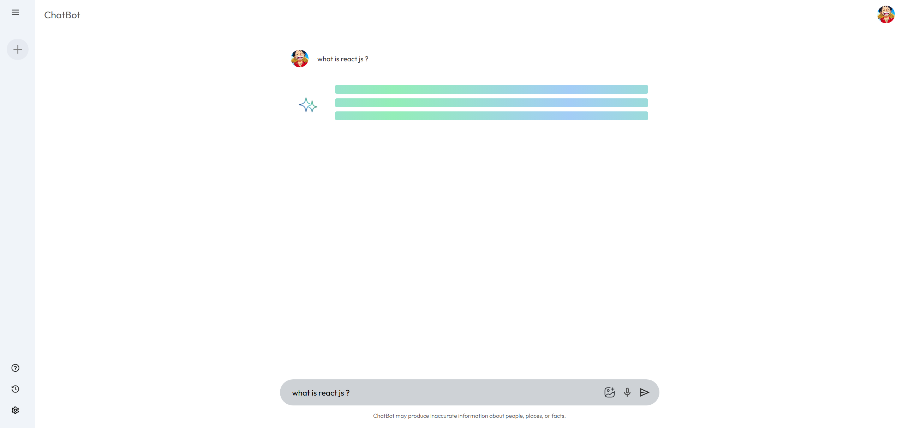
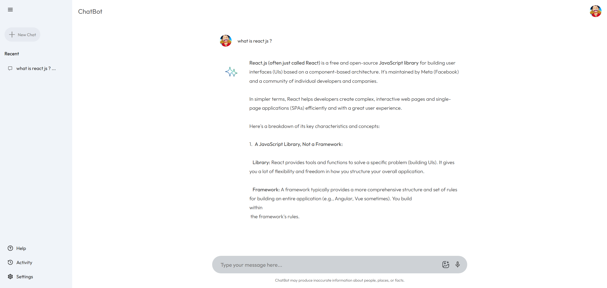

# 🤖 AI ChatBot Application

A modern, intelligent chatbot application powered by the **Google Gemini API**, built with **React**, **Vite**, and **Tailwind CSS**. This conversational AI assistant provides context-aware responses and delivers an intuitive user experience.



---

## ✨ Features

- 💬 **Intelligent Conversations** – Powered by Google Gemini API for context-aware responses
- 🎨 **Modern UI/UX** – Clean, minimalist design with smooth animations
- 📱 **Fully Responsive** – Optimized for desktop, tablet, and mobile devices
- 🚀 **Fast Performance** – Built with Vite for instant hot module replacement
- 💾 **Chat History** – Persistent conversation tracking with local storage
- 🎯 **Quick Actions** – Predefined prompts for common queries
- 🔊 **Voice Input** – Support for voice-to-text functionality
- 📸 **Image Support** – Ability to process and respond to image uploads

---

## 🚀 Tech Stack

| Technology | Purpose |
|-----------|---------|
| **React** | Frontend framework |
| **Vite** | Build tool and dev server |
| **Tailwind CSS** | Utility-first styling |
| **Google Gemini API** | AI language model |
| **JavaScript (ES6+)** | Core programming language |

---

## 📸 Application Preview

### Active Conversation

*Real-time response generation with loading indicator*

### Chat Interface

*Detailed AI responses with formatted text and conversation history*

---

## 📁 Project Structurechatbot/
├── node_modules/
├── public/
├── screenshots/              # Application preview images
├── src/
│   ├── assets/              # Images, icons, and static files
│   ├── components/          # React components
│   │   ├── ChatInterface.jsx
│   │   ├── MessageBubble.jsx
│   │   ├── InputBox.jsx
│   │   ├── Sidebar.jsx
│   │   └── SuggestedPrompts.jsx
│   ├── services/            # API integration
│   │   └── geminiService.js
│   ├── utils/               # Utility functions
│   ├── App.css
│   ├── App.jsx
│   ├── index.css
│   └── main.jsx
├── .env                     # Environment variables
├── .gitignore
├── index.html
├── package.json
├── tailwind.config.js
├── vite.config.js
└── README.md

---

## 🛠️ Installation & Setup

### Prerequisites
- Node.js (v14 or higher)
- npm or yarn
- Google Gemini API Key

### Steps

1. **Clone the repository**
```bashgit clone https://github.com/your-username/ai-chatbot.git

2. **Navigate to the project**
```bashcd ai-chatbot

3. **Install dependencies**
```bashnpm install

4. **Configure environment variables**
   
   Create a `.env` file in the root directory:
```envVITE_GEMINI_API_KEY=your_gemini_api_key_here

   Get your API key from [Google AI Studio](https://makersuite.google.com/app/apikey)

5. **Start the development server**
```bashnpm run dev

6. **Open in browser**http://localhost:5173


---

## 🎯 Features Breakdown

### Suggested Prompts
Quick-start prompts help users begin conversations:
- 🗺️ Suggest beautiful places for road trips
- 💡 Briefly summarize urban planning concepts
- 🎯 Brainstorm team bonding activities
- 💻 Improve code readability

### Chat Functionality
- Real-time message streaming
- Typing indicators
- Error handling and retry mechanisms
- Context-aware responses
- Multi-turn conversations

### User Interface
- **Left Sidebar**: Chat history, new chat button, settings
- **Main Area**: Conversation display with message bubbles
- **Input Box**: Text input with voice and image upload options
- **Bottom Disclaimer**: Information accuracy notice

---

## 🔧 API Integration

### Google Gemini API Setup
```javascript// src/services/geminiService.js
import { GoogleGenerativeAI } from "@google/generative-ai";const genAI = new GoogleGenerativeAI(import.meta.env.VITE_GEMINI_API_KEY);export const sendMessage = async (message) => {
const model = genAI.getGenerativeModel({ model: "gemini-pro" });
const result = await model.generateContent(message);
const response = await result.response;
return response.text();
};

### Key Features
- Asynchronous message handling
- Error boundary implementation
- Response streaming support
- Context management

---

## 📦 Build & Deploy

### Build for Production
```bashnpm run build
The optimized build will be in the `dist/` folder.

### Preview Production Build
```bashnpm run preview

### Deployment Options
- **Vercel** (Recommended) – Automatic deployments from Git
- **Netlify** – Easy drag-and-drop or Git integration
- **Firebase Hosting** – Google's hosting solution
- **Cloudflare Pages** – Fast global CDN

---

## 🎨 Customization

### Update Suggested Prompts
Edit the prompts in your main component:
```javascriptconst suggestedPrompts = [
{
icon: "🗺️",
text: "Suggest beautiful places to see on an upcoming road trip"
},
// Add more prompts
];

### Modify Styling
Update `tailwind.config.js`:
```javascriptmodule.exports = {
theme: {
extend: {
colors: {
'chat-primary': '#10a37f',
'chat-secondary': '#f7f7f8',
}
}
}
}

### Change AI Model
Switch between different Gemini models:
```javascript// gemini-pro: Fast responses, text-only
// gemini-pro-vision: Supports images
const model = genAI.getGenerativeModel({ model: "gemini-pro-vision" });

---

## 🔧 Available Scripts

| Command | Description |
|---------|-------------|
| `npm run dev` | Start development server |
| `npm run build` | Build for production |
| `npm run preview` | Preview production build |
| `npm run lint` | Run ESLint |

---

## 🔐 Environment Variables

Create a `.env` file with the following:
```envVITE_GEMINI_API_KEY=your_api_key_here
VITE_APP_NAME=ChatBot

**Important**: Never commit `.env` to version control!

---

## 🚨 Disclaimer

The chatbot uses AI and may occasionally produce inaccurate information about people, places, or facts. Always verify important information from reliable sources.

---

## 📝 Key Components

### Main Interface
- **Header**: Application title and user profile
- **Sidebar**: Navigation and chat history
- **Chat Area**: Message display with user and AI bubbles
- **Input Box**: Multi-modal input (text, voice, images)

### Sidebar Features
- ➕ New Chat button
- 📁 Recent conversation history
- ❓ Help section
- 📊 Activity tracking
- ⚙️ Settings panel

### Message Types
- User messages (right-aligned)
- AI responses (left-aligned with avatar)
- Loading indicators with shimmer effect
- Error messages with retry option

---

## 🎯 Use Cases

- **General Assistance**: Answer questions on various topics
- **Code Help**: Explain code concepts and debug issues
- **Content Creation**: Generate ideas and summaries
- **Learning**: Educational explanations and tutorials
- **Planning**: Brainstorm ideas and create plans
- **Research**: Quick information gathering

---

## 🐛 Known Issues & Limitations

- API rate limits may apply based on your Gemini API tier
- Response time depends on query complexity
- Image processing requires `gemini-pro-vision` model
- Chat history stored locally (browser-dependent)

---

## 🔜 Future Enhancements

- [ ] Multi-language support
- [ ] Export chat conversations
- [ ] Custom AI personality settings
- [ ] Advanced context management
- [ ] Code syntax highlighting
- [ ] Markdown rendering
- [ ] Dark/Light theme toggle
- [ ] User authentication
- [ ] Cloud-based chat history

---

## 🤝 Contributing

Contributions are welcome! Please feel free to submit a Pull Request.

1. Fork the project
2. Create your feature branch (`git checkout -b feature/AmazingFeature`)
3. Commit your changes (`git commit -m 'Add some AmazingFeature'`)
4. Push to the branch (`git push origin feature/AmazingFeature`)
5. Open a Pull Request

---

## 📄 License

This project is licensed under the MIT License - see the [LICENSE](LICENSE) file for details.

---

## 🙏 Acknowledgements

- [Google Gemini API](https://ai.google.dev/) – AI Language Model
- [React](https://reactjs.org/) – UI Framework
- [Vite](https://vitejs.dev/) – Build Tool
- [Tailwind CSS](https://tailwindcss.com/) – Styling
- [Lucide Icons](https://lucide.dev/) – Icon Library

---

## 👤 Author

**Kaushal Kumar**  
Full Stack Developer

- 🌐 Portfolio: [Your Website]
- 💼 LinkedIn: [Your LinkedIn]
- 🐙 GitHub: [Your GitHub]
- 📧 Email: xyz.430@gmail.com

---

## 📞 Support

For support, email xyz.430@gmail.com or open an issue in the GitHub repository.

---

## ⭐ Show Your Support

Give a ⭐️ if you found this project helpful!

---

<div align="center">
  <p>Built with ❤️ using React & Google Gemini API</p>
  <p>© 2026 Kaushal Kumar. All rights reserved.</p>
</div>
=======
## 🎯 Overview

This project is a **web-based AI chatbot** that integrates the **Google Gemini API** to generate intelligent, conversational responses in real time. It is built using **React, JavaScript, HTML, and CSS**, following a **component-based architecture** with centralized state management via **React Context API**. The application demonstrates how modern frontend systems can leverage **large language models (LLMs)** for real-world applications.

---

## 🔍 Business Problem

Traditional rule-based chatbots suffer from:

- Limited understanding of natural language
- No contextual awareness
- Poor scalability

With increasing demand for AI-driven conversational interfaces, developers need systems that are **intelligent, flexible, and production-ready**. This project solves these challenges using **Google Gemini**, a generative AI model.

---

## 🎯 Project Goal

The primary objectives of this project are:

- Build a **real-world AI chatbot**
- Integrate a **generative AI model** into a React application
- Demonstrate **clean frontend architecture**
- Create a **recruiter-ready portfolio project**

---

## 🛠️ Tools & Technologies

- **Frontend:** HTML, CSS, JavaScript, React
- **State Management:** React Context API
- **AI Model:** Google Gemini API
- **Build Tool:** Vite
- **Version Control:** Git & GitHub
- **Development Tools:** VS Code, npm

---

## 📁 Project Structure

```
src/
├── assets/
├── components/
│   ├── Sidebar/
│   │   ├── Sidebar.jsx
│   │   └── Sidebar.css
│   └── Main/
│       ├── Main.jsx
│       └── Main.css
├── Config/
│   └── chatbot.js
├── Context/
│   └── context.jsx
├── App.jsx
├── App.css
├── main.jsx
└── index.css
```

This structure ensures **modularity, scalability, and maintainability**.

---

## 🏗️ Architecture & Workflow

1. User enters a prompt in the chat interface
2. Input and messages are managed using **Context API**
3. Request is sent to the **Google Gemini API**
4. AI-generated response is returned asynchronously
5. UI updates dynamically with the response

This clean separation of UI, state, and API logic improves readability and extensibility.

---

## 🔌 Gemini API Integration

The Gemini API logic is implemented in:

```
src/Config/chatbot.js
```

API keys are securely handled using environment variables:

```env
VITE_GEMINI_API_KEY=your_api_key_here
```

Sensitive credentials are excluded from version control following industry best practices.

---

## 🚀 How to Run This Project

**1️⃣ Clone the repository**

```bash
git clone https://github.com/your-username/ai-chatbot-gemini.git
```

**2️⃣ Navigate to the project directory**

```bash
cd ai-chatbot-gemini
```

**3️⃣ Install dependencies**

```bash
npm install
```

**4️⃣ Create a `.env` file in the root directory**

```bash
touch .env
```

Add your Gemini API key:

```env
VITE_GEMINI_API_KEY=your_actual_api_key_here
```

**5️⃣ Start the development server**

```bash
npm run dev
```

**6️⃣ Open your browser**

Navigate to `http://localhost:5173` (or the port shown in your terminal)

---

## 🚀 Future Enhancements

- 🌙 Dark mode support
- 🔊 Voice input & output
- 💾 Persistent chat history
- 🔐 Backend proxy for enhanced API security
- 📱 Mobile-first UI improvements
- 🤖 Streaming AI responses
- 📊 Analytics dashboard
- 🌐 Multi-language support

---

## 👨‍💻 Author & Contact

**Kaushal Kumar**  
Frontend / Full Stack Developer  
React  • JavaScript • CSS • HTML

📧 Email: kaushalkr.585@gmail.com 
🔗 LinkedIn: https://www.linkedin.com/in/kaushal-kumar-1a0370377/
🐱 GitHub: https://github.com/kaushalkr585-cmd/

---
